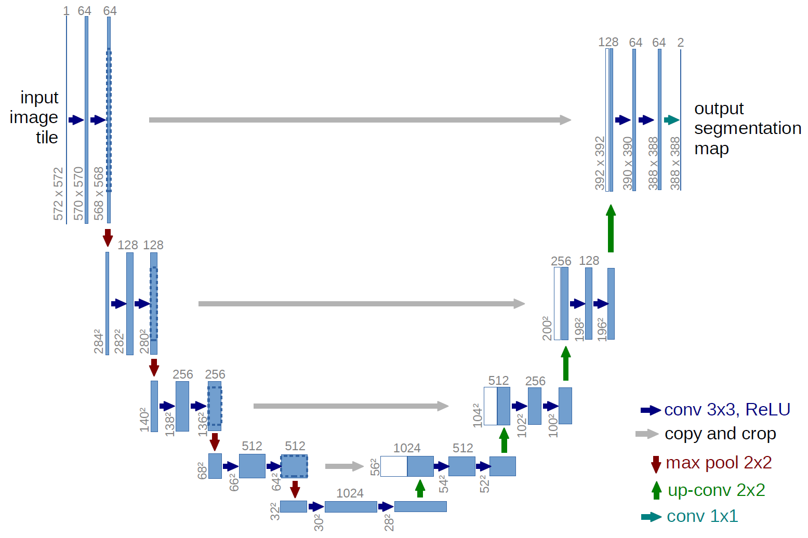

# U-Net Implementation in 
## Overview

### Data

* [CamVid](http://mi.eng.cam.ac.uk/research/projects/VideoRec/CamVid/)
### Model

## How to use
* Set hyper-parameters in train.sh for training and in eval.sh for evaluating
* run `bash train.sh` or `bash eval.sh`
* for more help, run `python train.py --help` or `python eval.py --help`